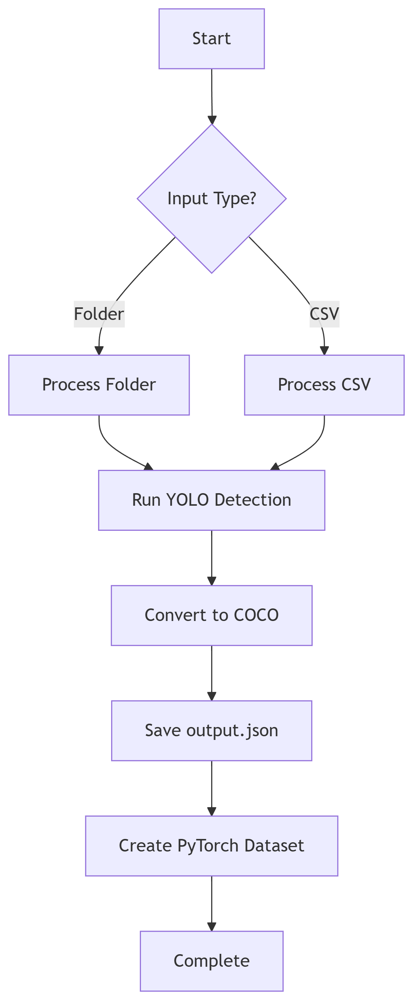

# COCO-CONVERTER

# Converting Data to COCO Dataset-like Format

This project provides a Python script to convert datasets (organized as folders or CSV files) into the COCO annotation format, with optional YOLO-based object detection for generating bounding box annotations.

Expected workflow: 

<p align="center">
  
</p>


---

## Features

- Convert a folder-structured dataset (images organized in class-named subfolders) into COCO format JSON.
- Convert CSV-based datasets (with image paths and labels) into COCO format JSON.
- Automatically run YOLOv5 detection on images to generate bounding box annotations.
- Combine YOLO detections with dataset info to produce complete COCO-style annotations.
- Provide a PyTorch Dataset class (`CocoDataset`) to load and use the generated COCO dataset easily.

---

## Requirements

- Python 3.7+
- PyTorch
- torchvision
- pandas
- PIL (Pillow)
- YOLOv5 weights (e.g., `yolov5s.pt`) 

---
## Download YOLOv5 Weights
To run YOLOv5 detection, you need the yolov5s.pt weights file. Download it using this command:
     
     wget https://github.com/ultralytics/yolov5/releases/download/v6.0/yolov5s.pt

## Setup

Install the required Python packages using:

   
    
    pip install -r requirements.txt
---

## Usage

Run the conversion script from the command line:

```bash
python coco_converter/full_script.py --data_dir PATH_TO_DATA --output OUTPUT_JSON

